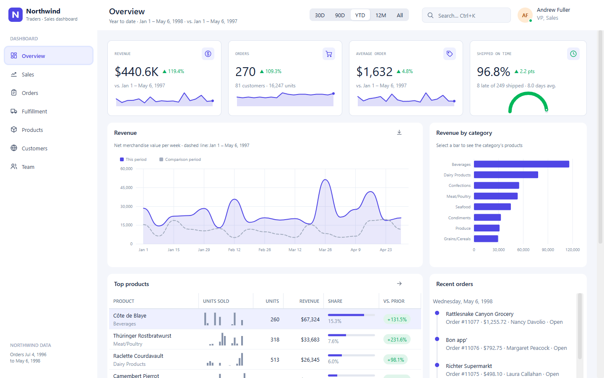

# Wisej.NorthwindDashboard

A Wisej.NET 4.1 sales dashboard for the classic **Northwind Traders** sample database, designed with the `Wisej.Web.NewControls` library. It targets `net10.0-windows` (Visual Studio designer) and `net10.0` (cross-platform hosting), like the rest of the solution.



## Run

```powershell
dotnet run --project Wisej.NorthwindDashboard -f net10.0
```

Open http://localhost:5090/Default.html. In Visual Studio, set `Wisej.NorthwindDashboard` as the startup project and press F5. As with the test app, running requires a Wisej.NET development or trial license. 

## What's inside

A sidebar shell (`MainPage`) hosts seven views. The period selector (30D, 90D, YTD, 12M, All) drives every view that reports on a period, and **Ctrl+K** opens a search palette over pages, periods, customers, products, people and order numbers.

| View | What it shows | NewControls used |
| --- | --- | --- |
| Overview | Revenue, orders, average order and on-time KPIs; weekly revenue against the comparison period; revenue by category; top products; recent orders; 12-month order heatmap; open orders by warehouse step | KpiPanel, ChartView, DataGridView subtitle/sparkline/meter/chip columns, Timeline, HeatmapCalendar, MeterBar |
| Sales | Category revenue over time with its table view, revenue bridge, top countries, product-mix treemap, revenue per bucket | ChartView (stacked column, waterfall, bar, treemap), DataGridView chip/subtitle columns |
| Orders | Status filters with counts, search, advanced rule builder, drill-down from other views | ChipGroup, QueryBuilder, EmptyState, DataGridView avatar/chip/subtitle/actions columns |
| Fulfillment | Shipper on-time rates and lead time; open orders as a board, a delivery calendar or a lead-time timeline | RadialGauge, KpiPanel, KanbanBoard, SchedulerView, GanttView, SegmentedButton |
| Products | Inventory health, stock status filters, catalog with stock coverage, reorder suggestions | MeterBar segments, ChipLabel, ChipGroup, ActionCardList, DataGridView sparkline/meter/chip/actions columns |
| Customers | Countries shaded by revenue quintile, clustered customer markers, account details, customer list | MapView, Avatar, Sparkline, Timeline, EmptyState, DataGridView avatar/sparkline/chip columns |
| Team | Organization chart, profile with a radar against the team average, top customers, leaderboard | OrgChart, Avatar, AvatarGroup, ChartView (radar), DataGridView avatar/meter/sparkline/chip columns |

The order details dialog (`Dialogs/OrderDialog`) uses a Stepper, ChipLabel and Avatars. Every view has a `.Designer.cs` file, so the layouts can be opened and edited in the Wisej designer; data is loaded in code once the shell assigns the session context.

## Data

- `Data/northwind.json` is converted from Microsoft's `instnwnd.sql` script in [microsoft/sql-server-samples](https://github.com/microsoft/sql-server-samples/tree/master/samples/databases/northwind-pubs) (MIT license, see [Data/LICENSE-northwind.txt](Data/LICENSE-northwind.txt)). Image columns are omitted; everything else, including the original 1996–1998 dates, is unchanged.
- `Data/countries.geojson` holds the outlines of the 21 customer countries, reduced from [Natural Earth](https://www.naturalearthdata.com/) 1:110m admin-0 countries (public domain).
- `Data/GeoLocations.cs` holds approximate city-center coordinates for the customer cities.

Both files are embedded resources loaded once into an immutable, shared `NorthwindDatabase`. The dashboard's "today" is the last recorded order date, **May 6, 1998**; periods and comparisons are relative to it, and a comparison is shown only when the recorded history fully covers it (12M and All have none).

Revenue is the net merchandise value of an order: discounted line totals rounded to cents, excluding freight, attributed to the order date. The all-time total is $1,265,793.04, matching Northwind's Order Subtotals view.

## Session state

The shared data is never modified. Each session has a `DashboardContext` that records:

- **Warehouse steps** on the fulfillment board. Northwind stores only order, required and shipped dates, so open orders start as *New* (placed within 4 days), *Picking* (within 10 days) or *Packed*, and can be moved from there. Moving an order to *Shipped*, or using *Mark as shipped*, records May 6, 1998 as its ship date; KPIs, gauges and the activity feed update accordingly.
- **Purchase orders** placed from the reorder suggestions or the product grid, which add to units on order and change stock positions.

These changes last for the session only.

## Design notes

- `Themes/Northwind.mixin.theme` is embedded and loaded after the library mixins. It restyles Bootstrap-4 toward the library's indigo palette and adds the shell appearances (`nw-card`, `nw-nav`, `nw-button`, …). Cards use Wisej's built-in panel header and header tools.
- Chart colors follow the library palette with a fixed categorical order per entity (category or shipper identifier), validated for color-vision deficiencies. Comparison periods use a de-emphasized gray, status colors are reserved for states, and multi-category charts are paired with a table showing the same values.
- Icons in `Assets/Icons` are outline SVGs that Wisej tints with the widget text color.

## Layout

```
Wisej.NorthwindDashboard/
├─ MainPage.cs            Shell, navigation, period selector, command palette
├─ Views/                 One DashboardView per area, plus grid row models and shared styles
├─ Dialogs/OrderDialog.cs Order details
├─ Data/                  Models, loader, periods, analytics, session context, embedded data
├─ Themes/                Application theme mixin
└─ Assets/                Logo and icons
```
